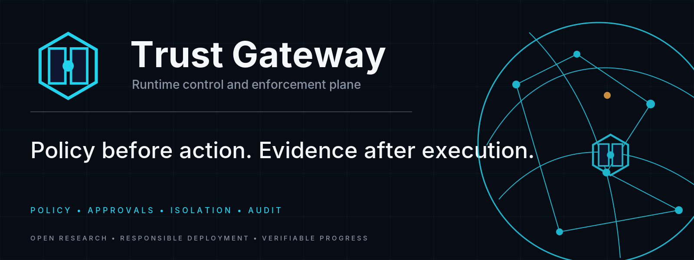

<!-- aftergraph-brand-os:v1.0.0 -->
<p align="center">
  <picture>
    <source media="(prefers-color-scheme: dark)" srcset=".github/assets/github/hero.webp">
    
  </picture>
</p>

# Trust Gateway

Runtime control and enforcement plane for governed autonomous agent work —
specialist bots (persona + persistent memory) with isolated tools, each action
decided **before** it happens (fail-closed) and sealed into a tamper-evident
audit chain.

> Trust Gateway is the runtime control and enforcement plane of the working
> ABDE Platform architecture. Its runtime evidence does not automatically
> establish AIE conformance or scientific claims.

**Brand note (provisional, once):** ABDE Intelligence is the current provisional brand candidate — not trademark cleared; `@Aftergraph` is a temporary namespace.

Positioning: `docs/COMPARISON-2026-09-02.md` (Grok Bot × OpenBot × Hermes).
Design: `docs/TRUST-GATEWAY-V1.md`. Roadmap: `docs/ROADMAP.md` (v3).

## Verified current state

The gateway is a zero-dependency Node.js runtime (SQLite persistence via
SqlChain, mounts-only HTTP surface). Verified surfaces — each backed by
dedicated modules and tests (175 test files):

| Surface | Modules |
|---|---|
| Tenant / auth / RBAC | `113-tenants.js`, `101-auth.js`, `102-identity.js`, `159-tenant-access.js`, scrypt user accounts + sessions (FS-A1) |
| Policy + approvals | `src/gateway/policy.js` (fail-closed classification: read/write/destructive/secret), durable approvals with TTL (`09-approvals.js`, `approvals-db.js`) |
| Budgets | `52-budgets.js` |
| Rate limiting | `53-rate-limit.js`, persistent rate ledger (`129-rate-ledger.js`, FS-M3) |
| Token / secrets security | `54-tokens.js`, external API keys (`112-apikeys.js`, `tgk_` sha256-stored), secrets vault + rotation (`115-secrets.js`, `119-`, `124-`) |
| Telegram bridge | `71-telegram.js`, `src/bridge/telegram.js` |
| Audit chain | write-ahead hash-chain audit, integrity check, prune + archive (`151-chain-integrity.js`, `142-`, `111-`) |
| Audit export + search | JSONL export (`117-`/`156-audit-export.js`), full-text audit search (`10-`/`131-audit-search.js`) |
| Plugin runtime | mounts system — every endpoint is a file in `src/gateway/mounts/` (`35-plugins.js`) |
| ComputerSession | jailed per-bot computers (`42-computer.js`, `src/gateway/computer.js`) |
| Artifacts | `40-artifacts.js`, `src/gateway/artifacts.js` |
| Adaptive Cards / Adaptive Workspace | `57-cards.js`, console app `app/` (cards.js, compose.js, workspace primitives) |
| Provider/model routing | `45-providers.js`, `85-`/`92-providers*` (OpenAI-compatible mount, live probing) |
| Ops | backup/restore with sha256 manifest + chain-head binding (`110-`, `155-`), feature flags (`126-`/`130-`), tenant quotas, operator dashboard (`135-`), healthz deep (`145-`), webhooks (`125-`/`150-`) |
| Skills / harness2 | skills as governed objects with approval-gated run (`105-skills.js`, `147-skill-sandbox.js`), jailed build/run project model (`55-harness.js`, `106-harness2.js`) |

Wave-B (integrated in HEAD): Wave-B surfaces + Adaptive Cards slice composed
onto the FS architecture. Conformance: tier-A 9/9 domains, tier-B and tier-C
batteries with evidence in `docs/ROADMAP.md`.

## Core guarantees (unchanged since v1)

1. **Unknown tool = destructive** (fail closed) → requires human approval
2. **Destructive is never auto-executed** — not even with capability
3. **Secret values never reach the audit** — only length is logged
4. **Write-ahead audit** — refusals and crashes are on record too
5. **Tamper-evident** — one changed byte breaks all subsequent hashes
6. **Approvals expire fail-closed** (TTL)

## Run

```bash
npm test          # unit + integration tests (node:test, 0 dependencies)
npm run demo      # live HTTP demo: full bot workflow incl. tamper detection
```

### Bot SDK

Zero-dependency Node client (`src/gateway/client.js`):

```js
const { GatewayClient } = require('./src/gateway/client');
const gw = new GatewayClient({ baseUrl: 'http://127.0.0.1:8800', token: process.env.TG_TOKEN });
const r = await gw.action('fs.read:notes/x.md');
```

Methods: `action(tool, args?)`, `pending()`, `approve(id)`, `deny(id)`,
`verify()`, `audit(since=0)`. See `example/bot.js` for a complete
read → write → needs_approval → human-in-the-loop workflow.

### Operator console

`example/console.js` shows the governed loop: propose → approve → seal.
A full web console lives in `app/` (login, tenant picker, chat, cards,
compose, icons, offline page).

### Plugin mounts

New endpoints are files in `src/gateway/mounts/` — never touch `server.js`.
Each file exports `{ name, method, path, auth, handle }`; auth modes:
`bearer`, `query` (?token=), `none`. Function-style mounts are wired through
the router facade with `:param` matching and RBAC.

## Honest limits (documented, not hidden)

- Jail is process discipline, not an OS sandbox (OS-sandbox hardening on roadmap).
- Docs/site commercial claims carry nuance per the transparency wave (FS-E4);
  see `docs/ROADMAP.md` gap analysis.

## License

Apache-2.0.

---

**Brand status:** Aftergraph / ABDE Intelligence are PROVISIONAL — NOT TRADEMARK CLEARED. No irreversible branding until clearance.
